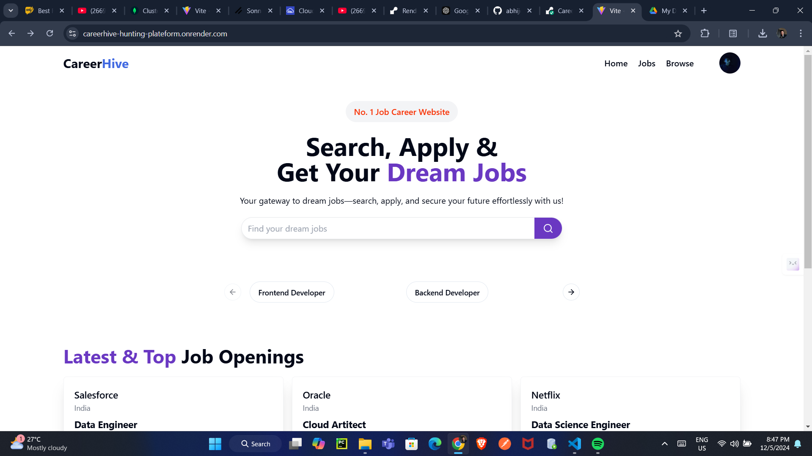
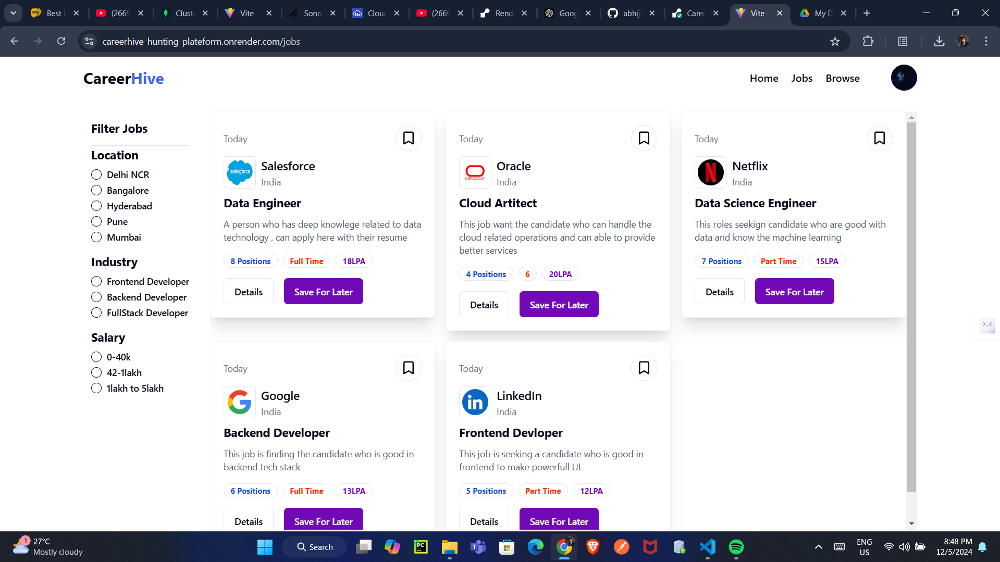
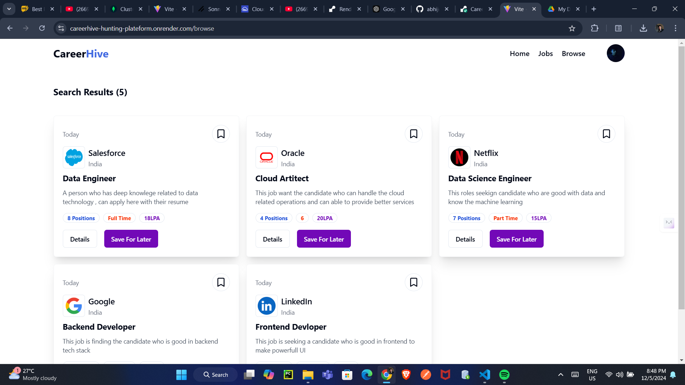

# CareerHive - MERN Stack job Application
### Live Website
[Check out the live website here](https://careerhive-hunting-plateform.onrender.com)

**CareerHive** is a MERN (MongoDB, Express.js, React.js, Node.js) stack project designed to help users search, apply, and find their dream jobs. It features a user-friendly interface and essential functionalities for job hunting.

## Features

- **Job Search**: Search for jobs using keywords.
- **Job Categories**: Filter jobs by categories such as Frontend Developer, Backend Developer, and Data Engineer.
- **Authentication**: User login and signup functionality.
- **Responsive Design**: Fully responsive and mobile-friendly design.
- **Interactive Dashboard**: Display latest and top job openings.

## Screenshots

<!--  -->
<center>  </center>
<center>  </center>
<center>  </center>

### Video Demo
[Watch the Video Demo](https://drive.google.com/file/d/1OZ8FrSV4jwdYFDpBzmtRJNs-jMaXgPFg/view?usp=sharing)


## Tech Stack

### Frontend
- **React.js**: User interface
- **CSS/Bootstrap**: Styling and layout
- **React Router**: Navigation

### Backend
- **Node.js**: Runtime environment
- **Express.js**: Backend framework
- **MongoDB**: NoSQL database

### Tools and Libraries
- **Mongoose**: MongoDB object modeling
- **JWT**: User authentication
- **Axios**: API requests

## Installation and Setup

Follow these steps to run the project locally:

### Prerequisites
- **Node.js** (v16+)
- **MongoDB** (local or cloud)
- **Git**

### Clone Repository
```bash
git clone https://github.com/abhijeetGithu/CareerHive-hunting-plateform.git
```

### Install Dependencies

#### Backend
```bash
cd backend
npm install
```

#### Frontend
```bash
cd frontend
npm install
```

### Environment Variables

Create a `.env` file in the `backend` folder and add the following variables:
```
MONGO_URI=<your-mongo-db-uri>
JWT_SECRET=<your-jwt-secret>
PORT=5000
```

### Run the Application

#### Backend
```bash
cd backend
npm start
```

#### Frontend
```bash
cd frontend
npm start
```

### Open Application

Visit `https://careerhive-hunting-plateform.onrender.com` to view the application.

## Folder Structure

```
CareerHive/
├── backend/        # Backend code
│   ├── models/     # Mongoose models
│   ├── routes/     # API routes
│   ├── controllers # Route handlers
│   ├── config/     # Configuration files
│   └── server.js   # Entry point for backend
├── frontend/       # Frontend code
│   ├── src/        # React source files
│   ├── public/     # Public assets
│   └── package.json
├── README.md       # Project documentation
```

## Deployment

1. **Backend**: Use platforms like Heroku or Render for deploying the backend.
2. **Frontend**: Deploy the React application using Vercel, Netlify, or similar.

## Contributing

Feel free to contribute to this project by:
- Reporting bugs
- Suggesting features
- Submitting pull requests

## License

This project is licensed under the MIT License. See the `LICENSE` file for details.

---

**Contact Information**

- **Developer**: [Abhijeet Singh](mailto:abstar072002@gmail.com)
- **GitHub**: [My Github](https://github.com/abhijeetGithu)
